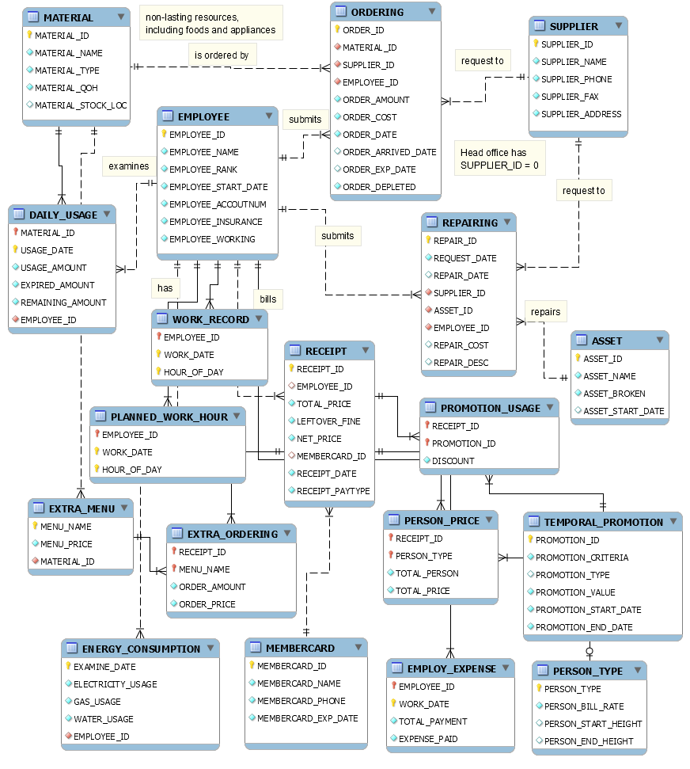

# shabu
Simple Shabu store manager web application. It's my Database course assignment.

This was completely written in pure PHP, Javascript and HTML. There was no front-end framework involved. There's one catch though, I use jQuery for managing the HTML DOM. The database is based on MySQL. HTTP Web server engine is Apache. Everything about design pattern is a mess. It was meant to work around the facing problem at hand.

## Screenshots
#### Application User Interface

#### Entity Relationship Diagram

