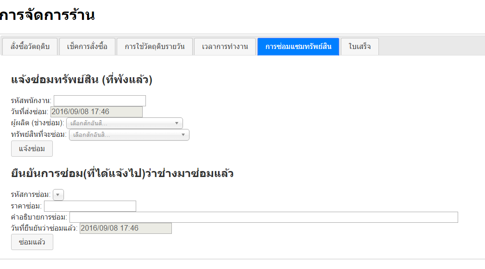

# shabu
Simple Shabu store manager web application. It's my Database course assignment built for local intranet usage only.

This app looks pretty dumb but it consumed a lot of energy out of my head!

### How I wrote this app (and my rant)
This app was completely written in pure PHP, Javascript and HTML. There was no front-end framework involved. There's one catch though: I use jQuery for managing the HTML DOM, so some people count that as not "from scratch coding".

I wrote Javascript in old school style. Today people are using ECMAScript 6 (**ES6**). 'var' is deprecated and they prefer using 'let' or 'const' to define variables instead. Oh man, web development is so overwhelming, technology moves so fast even The Flash has to say "Calm down, you are moving too fast, bro".

You need to be learning all the time to survive in this technological era. Web will always move at a very fast-paced.

### Technology Stack I Used
 The database is based on MySQL. HTTP Web server engine is Apache. Everything about design pattern is a mess. Every code you see was meant to work around the facing problem at hand. Look at this repository as a bad example you want to avoid replicating at all cost.

If you are craving for the stack name, my solution stack is specifically **LAMP** (Linux, Apache, MySQL, PHP). But wait a minute, I develop this on Windows with Xampp installed. So I guess you should call my stack **WAMP** instead.

## Screenshots
#### Application User Interface

#### Entity Relationship Diagram

